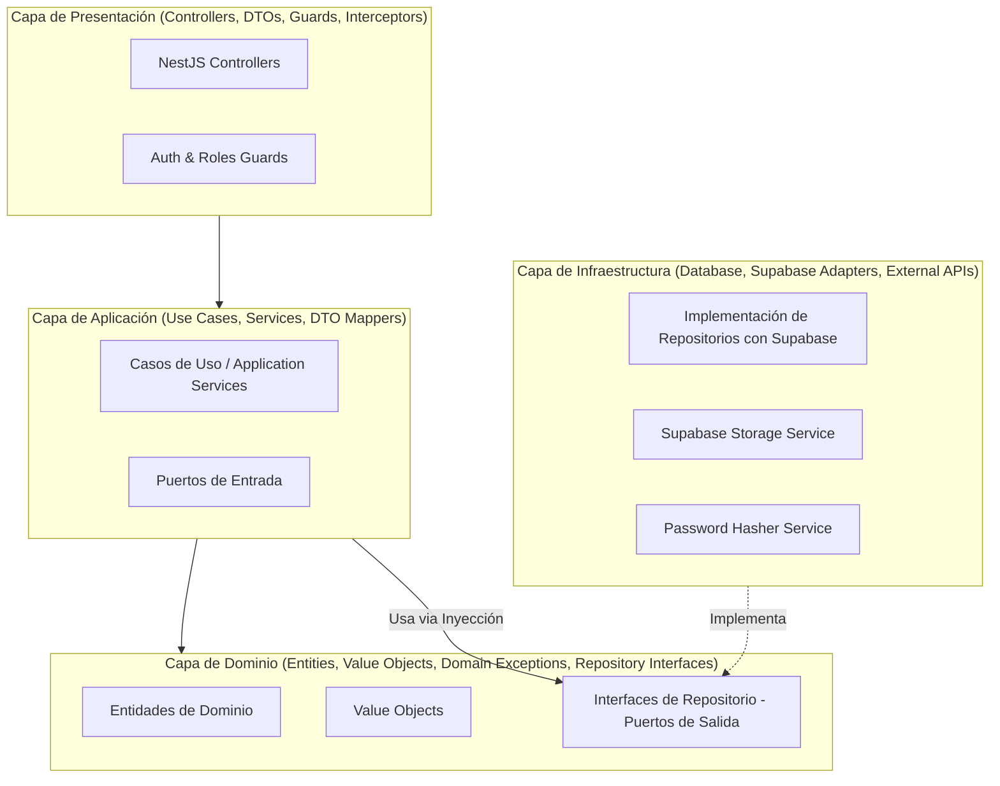

# 🤖 CONTEXTO MAESTRO DEL PROYECTO (AI_CONTEXT.md)
> **Directiva para Agentes de Inteligencia Artificial**: Este documento es la fuente de verdad principal para entender la arquitectura, el modelo de datos, las reglas de negocio y los estándares de codificación de este proyecto. Léelo antes de generar, refactorizar o planificar código en cualquier módulo.

---

## 1. Visión General del Proyecto
El sistema es una **Plataforma Integral de Gestión y Reserva de Canchas Deportivas** (Futsal, Wally, Racket, etc.) diseñada para operar múltiples complejos deportivos.

Permite a los **Clientes** explorar instalaciones, consultar disponibilidad en tiempo real mediante calendario, bloquear turnos por 5 minutos, pagar un anticipo del 25% vía código QR y pagar el saldo pendiente (75%) al llegar a las instalaciones.
Permite a las **Secretarias / Cajeras** validar comprobantes de pago, registrar reservas manuales/WhatsApp, gestionar inasistencias y cancelaciones, controlar el acceso a la cancha y realizar el arqueo/cierre de caja de su jornada.
Permite al **Administrador / Propietario** gestionar complejos, canchas, precios históricos por hora, horarios habituales y especiales, inhabilitaciones por incidentes/mantenimiento, y analizar métricas operativas críticas (afluencia por horarios, canchas más vacías y rentabilidad).

---

## 2. Stack Tecnológico

| Componente | Tecnología | Versión / Detalle |
| :--- | :--- | :--- |
| **Backend** | NestJS | 11.x (TypeScript 5.7+, Express, Node.js 22+) |
| **Frontend** | Angular | 20.x (Standalone Components, Signals, SSR opcional, SCSS) |
| **Base de Datos** | PostgreSQL / Supabase | PostgreSQL 15+ alojado en Supabase Cloud |
| **Almacenamiento** | Supabase Storage | Buckets para `payment-receipts` y `complex-qrs` |
| **Autenticación** | Supabase Auth / JWT | Tokens JWT validados en NestJS con Guards |
| **Validación** | class-validator & class-transformer | Validación estricta en DTOs de entrada |

---

## 3. Arquitectura del Sistema: Arquitectura por Capas + Principios SOLID

El backend sigue rigurosamente una **Arquitectura en Cuatro Capas**, asegurando desacoplamiento y testabilidad:

### Aplicación Estricta de Principios SOLID

1. **S - Single Responsibility (Responsabilidad Única)**: Cada caso de uso realiza exactamente una acción orquestada (ej. `CreateTemporalReservationUseCase`, `ValidatePaymentUseCase`, `CloseCashShiftUseCase`). Ningún servicio debe convertirse en un "God Object".
2. **O - Open/Closed (Abierto/Cerrado)**: Estrategias de cálculo de precio o métodos de pago (`PaymentMethodStrategy`) extensibles sin modificar las clases de uso existentes.
3. **L - Liskov Substitution (Sustitución de Liskov)**: Las implementaciones de repositorios (`SupabaseReservationRepository`, `InMemoryReservationRepository`) pueden intercambiarse sin romper los casos de uso.
4. **I - Interface Segregation (Segregación de Interfaces)**: Repositorios e interfaces divididos por responsabilidad en lugar de una interfaz monstruosa (ej. `IReservationReaderRepository`, `IReservationWriterRepository`).
5. **D - Dependency Inversion (Inversión de Dependencias)**: Los casos de uso dependen exclusivamente de abstracciones (interfaces de TypeScript / Tokens de Inyección en NestJS), nunca de clientes concretos de Supabase.

---

## 4. Esquema de Base de Datos (Supabase)

La base de datos relacional consta de 8 entidades normalizadas:

1. `users`: Usuarios del sistema (`CLIENTE`, `SECRETARIA`, `ADMIN`), con CI, teléfono, email único y hash de contraseña.
2. `complexes`: Complejos deportivos con ubicación física, contacto y URL del QR de cobro.
3. `courts`: Canchas por complejo, tipo de deporte (`Futsal`, `Wally`, `Racket`), precio/hora actual y estado activo.
4. `court_schedules`: Horarios semanales por día (1=Lunes..7=Domingo) y excepciones por fecha específica (`specific_date`).
5. `court_incidents`: Registro de canchas inhabilitadas por mantenimiento o imprevistos (bloquean disponibilidad).
6. `reservations`: Reservas con control de expiración (5 minutos de bloqueo temporal), congelación del `price_per_hour` histórico, cálculo de anticipo (25%) y saldo, estados (`TEMPORAL`, `PENDING_VALIDATION`, `CONFIRMED`, `CANCELLED`, `REPROGRAMMED`, `COMPLETED`, `EXPIRED`, `NO_SHOW`) y trazabilidad de reprogramaciones (`parent_reservation_id`).
7. `payments`: Transacciones de anticipo y saldo final, métodos (`QR`, `EFECTIVO`), URL del comprobante, estados (`PENDING`, `VALIDATED`, `REJECTED`) y secretaria responsable (`handled_by`).
8. `cash_shifts`: Cuadre y cierre de turno de caja de secretarias (`total_system` vs `total_declared`).

---

## 5. Reglas de Negocio Críticas (Invariantes de Dominio)

Cualquier agente de IA que genere lógica de negocio debe respetar estas reglas:

1. **Bloqueo Temporal de 5 Minutos**:
   - Al seleccionar un horario disponible, se crea una reserva en estado `TEMPORAL` con `expires_at = now() + 5 minutes`.
   - Durante esos 5 minutos, nadie más puede reservar ese bloque en esa cancha.
   - Si no se registra el comprobante de pago antes de `expires_at`, la reserva expira y el horario vuelve a estar disponible.
2. **Duración de Reservas**:
   - Duración mínima: **1 hora exacta**.
   - No se permiten fracciones de hora (prohibidos 30 minutos, 90 minutos, etc.).
   - Se permiten bloques de horas completas consecutivas (ej. 1h, 2h, 3h).
   - El inicio puede ser en punto o a media hora (ej. `08:30 -> 09:30` ✅, `08:30 -> 10:30` ✅, pero `08:00 -> 09:30` ❌).
3. **Monto de Anticipo y Saldo**:
   - `advance_required = total_price * 0.25` (25% exacto).
   - Saldo pendiente al llegar al complejo = `total_price - advance_required` (75% restante).
4. **Inmutabilidad del Precio Histórico**:
   - Al registrar una reserva, se almacena `reservations.price_per_hour` con el valor vigente en `courts.price_per_hour` en ese instante. Si el administrador sube el precio de la cancha al día siguiente, las reservas ya pactadas **no cambian**.
5. **Políticas de Cancelación y Reprogramación**:
   - El anticipo **no es reembolsable por defecto**.
   - Las reprogramaciones no son automáticas: son autorizadas y gestionadas por la secretaria o administrador, vinculando `parent_reservation_id`.
   - Las excepciones de devolución deben ser auditadas con motivo explícito.
6. **Control de Acceso Físico a Cancha**:
   - El cliente no puede ingresar a jugar hasta que la secretaria registre el pago del 100% del saldo pendiente en efectivo o QR.
7. **Control de Inasistencias (No-Show)**:
   - Una reserva no se libera automáticamente al pasar la hora; la secretaria toma la decisión operativa de marcarla como inasistencia y liberar la cancha si corresponde.

---

## 6. Índice de Documentación Detallada

Para consultar especificaciones técnicas exhaustivas, consulta los siguientes archivos en `/docs`:

- **[01. Arquitectura en Capas y SOLID](file:///c:/Users/Mateo/Documents/Mateo%20Tareas/Calidad/docs/01-architecture-solid.md)**: Estructura de carpetas de NestJS, separación de responsabilidades, diagrama de clases e interfaces.
- **[02. Base de Datos Supabase](file:///c:/Users/Mateo/Documents/Mateo%20Tareas/Calidad/docs/02-database-supabase.md)**: Script DDL completo, diagramas ERD, índices de alto rendimiento, triggers y políticas RLS.
- **[03. Reglas de Negocio](file:///c:/Users/Mateo/Documents/Mateo%20Tareas/Calidad/docs/03-business-rules.md)**: Fórmulas matemáticas, diagramas de estados de reservas y pagos, validaciones cronometradas.
- **[04. Matriz de Historias de Usuario](file:///c:/Users/Mateo/Documents/Mateo%20Tareas/Calidad/docs/04-user-stories-matrix.md)**: Cobertura completa de las 74 HUs (25 Cliente, 26 Secretaria, 25 Administrador).
- **[05. Especificación Backend NestJS](file:///c:/Users/Mateo/Documents/Mateo%20Tareas/Calidad/docs/05-backend-spec-nestjs.md)**: Módulos, controladores, DTOs, casos de uso, filtros de excepción y servicios.
- **[06. Especificación Frontend Angular 20](file:///c:/Users/Mateo/Documents/Mateo%20Tareas/Calidad/docs/06-frontend-spec-angular.md)**: Componentes standalone, Signals, guards por rol, calendario interactivo y gestión de estado.
- **[07. Guía Operativa para Agentes de IA](file:///c:/Users/Mateo/Documents/Mateo%20Tareas/Calidad/docs/07-ai-agent-guide.md)**: Flujo de trabajo estándar para implementar nuevas funcionalidades paso a paso.

---

## 7. Reglas de Oro para Agentes de IA que escriban código

1. 🚫 **NUNCA** coloques lógica de base de datos directa (SQL/Supabase SDK) dentro de un Controlador o un Caso de Uso. Crea o usa una interfaz en Dominio e impleméntala en Infraestructura.
2. 🚫 **NUNCA** mutes reservas confirmadas al cambiar el precio de una cancha.
3. 🚫 **NUNCA** omitas la validación del tiempo de expiración (5 min) en la creación de reservas temporales.
4. ✅ **SIEMPRE** usa DTOs con decoradores de `class-validator` para entradas de la API.
5. ✅ **SIEMPRE** documenta los métodos de casos de uso indicando a qué Historia de Usuario corresponden (ej. `@reference HU-CLI-11`).
6. ✅ **SIEMPRE** maneja montos monetarios con dos decimales (`NUMERIC(10,2)`).
